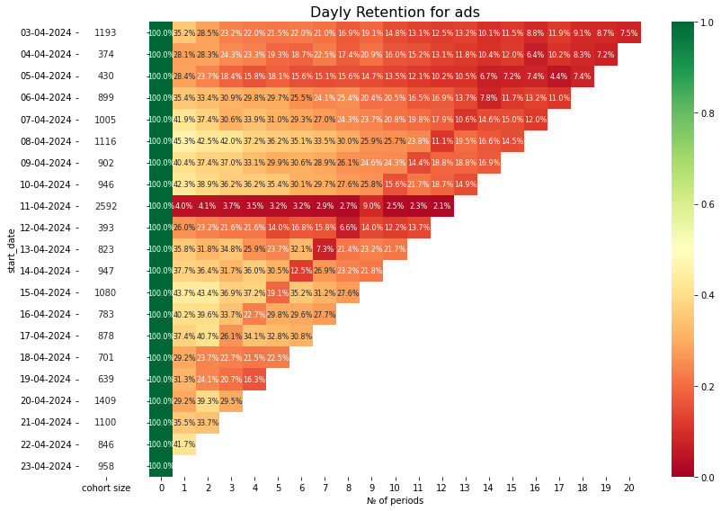
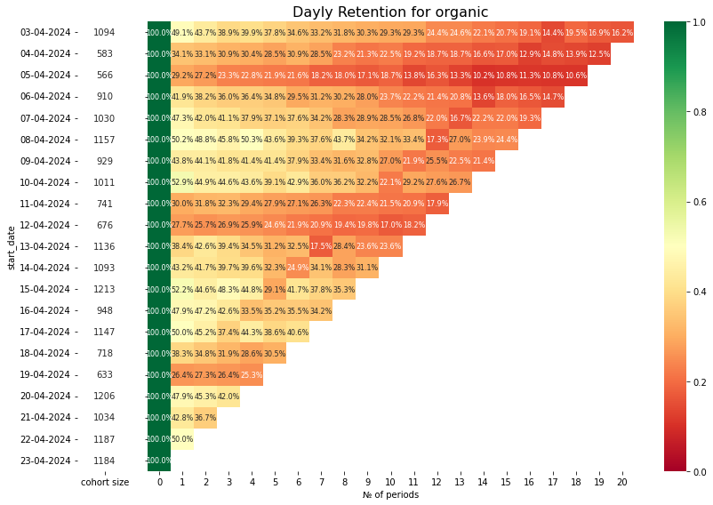
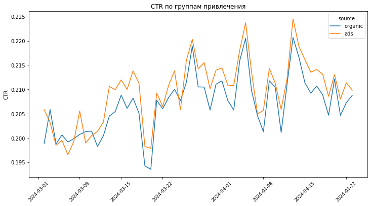
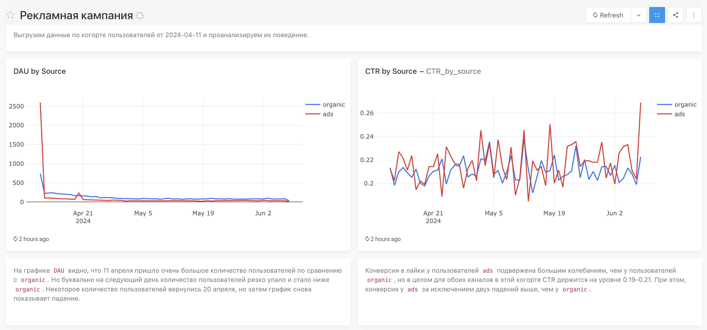
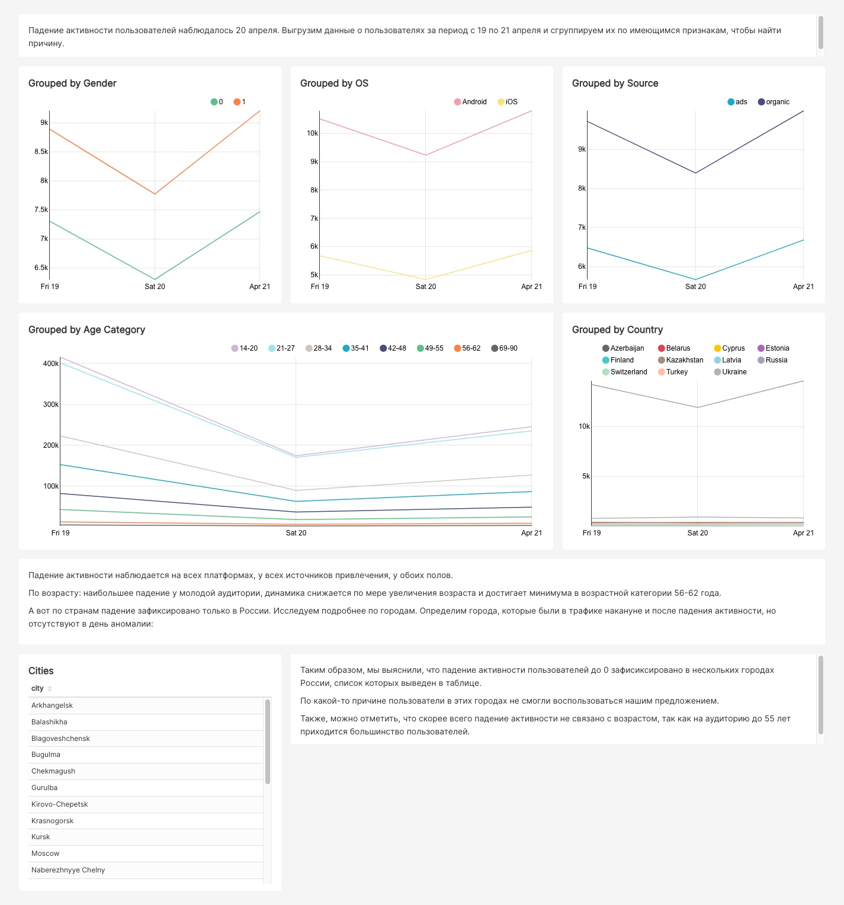
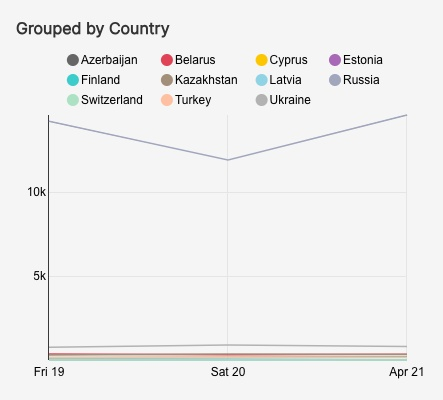
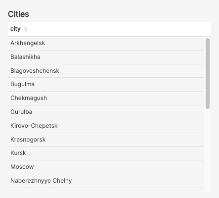

# Анализ продуктовых метрик

## Оглавление:

[1. Описание проекта.](#1-описание-проекта) 
[2. Краткая информация о данных.](#2-краткая-информация-о-данных) 
[3. Этапы работы над проектом.](#3-этапы-работы-над-проектом) 
[4. Использованные инструменты и библиотеки.](#4-использованные-инструменты-и-библиотеки) 

### 1. Описание проекта.

**Retention rate** в сочетании с другими метриками позволяет довольно хорошо описать, что происходит в продукте. DAU как активность пользователей может не означать реального интереса пользователей к продукту, так как рост этой метрики может быть искусственным и не отражать долговременную вовлеченность. 

Если же мы хотим понять, сколько пользователей реально остается и продолжает пользоваться продуктом, мы должны посчитать **Retention**.

Существует несколько вариантов рассчета метрики Retention. Например:

**Retention rate = (покупатели на конец периода - новые покупатели за период) / покупатели на начало периода x 100%**

или:

**количество активных пользователей за текущий период / общее число пользователей за прошлый период**

или:

**число пользователей за n-ый период / число пользователей в когорте**

В нашем приложении ленты новостей есть два типа пользователей: те, кто пришел через платный трафик (`source='ads'`) и те, кто пришел через органические каналы (`source='organic'`).

#### 1.1. Retention по каналам привлечения.

В первой части проекта ([ноутбук](Retention_by_source.ipynb)) мы анализируем и сравниваем Retention этих двух групп пользователей за период в 20 дней по когортам и оцениваем, отличается ли характер использования приложения у этих групп.

На тепловых картах хорошо видно разницу в характере использования приложения:

Кроме того сделана визуализация Retention 1-, 5-, 7-, 11-дня для обеих групп пользователей и построен график CTR по группам:

Сделаны следующие выводы:

1. Общее количество пользователей по каналам привлечения приблизительно одинаковое, но это связано с тем, что в период проведения рекламной акции 11 апреля был наплыв пользователей с канала `ads`. В целом по когортам в основном количество пользователей `organic`выше, чем `ads`.

2. На тепловых картах Retention хорошо заметно, что метрика для `organic` выше, чем для `ads`. Это говорит о том, что пользователям, привлеченным через платный трафик может быть не интересно наше приложение и нужно разбираться в причинах низкого показателя удержания пользователей. Особенно низкий Retention в когорте 11 апреля - только очень небольшой процент привлеченных рекламной акцией пользователей остались с нами. Это хорошо видно на диаграммах Retention по дням.

3. Однако, поюзерный CTR у пользователей `ads`как будто бы выше, чем у `organic` на протяжении практически всего времени работы приложения (некоторые падения показателя относительно `organic` заметны до 10 марта).

Необходимо разбираться с причинами низкого показателя удержания для `ads`, при этом в высоких относительно `organic` показателях CTR есть потенциал для поиска возможных решений.

#### 1.2. Рекламная кампания.

Вторая часть проекта посвящена изучению поведения пользователей после проведения массивной рекламной кампании, в результате которой в приложение пришло много пользователей. эта задача решена с помощью дашборда в `Redash` - [код запросов](promo.md):

Сделаны следующие выводы:

1. Буквально на следующий день после проведения рекламной кампании количество привлеченных с ее помощью пользователей резко упало и стало ниже `organic`. 

2. Конверсия в лайки у пользователей `ads` подвержена большим колебаниям, чем у пользователей `organic`, но в целом для обоих каналов в этой когорте CTR держится на уровне 0.19-0.21. При этом, конверсия у `ads` за исключением двух падений выше, чем у `organic`.

Таким образом, аудиторию удалось привлечь, но не удалось удержать.

#### 1.3. Падение активности пользователей.

В третьей части проекта мы должны найти причину внезапного падения активности пользователей. 
Для решения этой задачи использовался дашборд в `Supersert`. Были выгружены данные о пользователях за период за день до падения активности и после, затем построены графики с группировкой по всем возможным объединяющим признакам: полу, платформе, источнику привлечения, возрастным категориям, странам.

Падение активности наблюдалось на всех платформах, у всех источников привлечения, у обоих полов. По возрасту: наибольшее падение зафиксировано у молодой аудитории, динамика снижается по мере увеличения возраста и достигает максимума в возрастной категории 56-62 года.

По странам падение зафиксировано только в России. 

Был определен список городов, в которых активность пользователей равна 0:

Выводы: 
1. Падение активности пользователей зафиксировано в нескольких городах России - скорее всего, по технической причине пользователи в этих городах не смогли воспользоваться нашим приложением. 
2. Падение активности, все-таки, не связано с возрастом, так как на аудиторию до 55 лет приходится большинство пользователей.

⬆️[К оглавлению](#оглавление)

### 2. Краткая информация о данных.

Данные содержат информацию о ленте новостей и мессенджере и обновляются в режиме реального времени. В ClickHouse находятся две таблицы: по ленте новостей и по мессенджеру. Поля содержат информацию о действиях пользователей (просмотрах и лайках), постах, отправленных и полученных сообщениях, о поле, стране и городе и т.п.

⬆️[К оглавлению](#оглавление)

### 3. Этапы работы над проектом.
1. Расчет Retention по каналам привлечения и когортам.
2. Построение дашборда для анализа рекламной кампании.
3. Построение дашборда для анализа причин падения пользователей.
 

⬆️[К оглавлению](#оглавление)

### 4. Использованные инструменты и библиотеки.
* Apache Superset
* Redash
* ClickHouse
* matplotlib==3.3.2 
* seaborn==0.11.0 
* pandahouse==0.2.7 
* pandas==2.0.2

⬆️[К оглавлению](#оглавление)