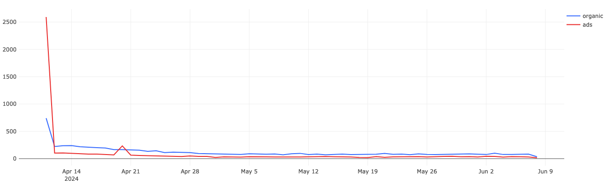
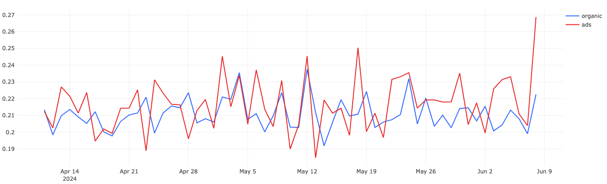

Маркетологи запустили массивную рекламную кампанию, в результате в приложение пришло довольно много новых пользователей. Дата рекламной кампании 2024-04-11.
Выгрузим данные по когорте пользователей от этой даты и проанализируем их поведение.


## DAU by Source

```
SELECT
    COUNT(DISTINCT user_id) AS active_users,
    date,
    source
FROM
    (SELECT user_id
    FROM (
            SELECT DISTINCT user_id,
               min(toDate(time)) OVER (PARTITION BY user_id) AS start_date
            FROM simulator_20240420.feed_actions
        ) 
    WHERE start_date = '2024-04-11') t1

JOIN

    (SELECT 
        user_id,
        toDate(time) AS date,
        source,
        action
    FROM simulator_20240420.feed_actions
    ) t2
USING user_id

GROUP BY date, source
```


На графике `DAU` видно, что 11 апреля пришло очень большое количество пользователей по сравнению с `organic`. Но буквально на следующий день количество пользователей резко упало и стало ниже `organic`. Некоторое количество пользователей вернулись 20 апреля, но затем график снова показывает падение.

## CTR by Source

```
SELECT
    countIf(user_id, action = 'like') / countIf(user_id, action = 'view') AS ctr,
    date,
    source
FROM    
    (SELECT
        user_id,
        date,
        source,
        action
    FROM
        (SELECT user_id
        FROM (
                SELECT DISTINCT user_id,
                   min(toDate(time)) OVER (PARTITION BY user_id) AS start_date
                FROM simulator_20240420.feed_actions
            ) 
        WHERE start_date = '2024-04-11') t1
    
    JOIN
    
        (SELECT 
            user_id,
            toDate(time) AS date,
            source,
            action
        FROM simulator_20240420.feed_actions
        ) t2
    USING user_id
    )
GROUP BY date, source
```


Конверсия в лайки у пользователей `ads` подвержена большим колебаниям, чем у пользователей `organic`, но в целом для обоих каналов в этой когорте CTR держится на уровне 0.19-0.21. При этом, конверсия у `ads` за исключением двух падений выше, чем у `organic`.
